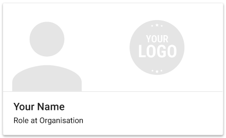
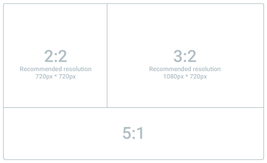

# Technical Specifications

## How does it work?

Haystack is a new way to manage your professional contacts. Create a beautiful card that you can share instantly with anyone, and take control of the information your key business contacts have about you.

- When the app is first opened, users are prompted to create their card. This is what will be shared when they exchange contact details
- Haystack Enterprise customers can control and limit the customization available for all users in a particular email domain. ACME brands for example, can control the logo, and colors of all cards created with an @acme.com email address. If you have more complicated email branding needs, we can help.
- Users can use Haystack to scan paper business cards, and instantly share their digital card back - to any platform (Android, iOS, Windows Phone, Web, vCard)
- Anyone who receives a Haystack card can save it to their device - whether they use Haystack or not. New users first see a mobile web version of Haystack card, which they can save directly to their device.
- Users who receive a Haystack card and already have the app installed can save the card directly to their Haystack list
- All of a user's contacts are saved in their Haystack account - accessible across devices and on the web, and safely backed up automatically

## Haystack Enterprise Subscriptions and Deployment Support

We charge a fee based on the size of your organization. Subscriptions are charged monthly on an ongoing basis.

During the first month of your Enterprise subscription, our team will work to ensure that your Brand's customizations are implemented correctly, and that your technical and end user support teams are ready to deploy Haystack across your organization.

## Privacy

Haystack takes our user's privacy seriously. Your Haystack card can only be seen by you and the people you have shared your card with.
You can view our [Privacy Policy]({{site.privacy_policy}}) or our [Terms & Conditions]({{site.terms_and_conditions}}) for more information. Haystack will never sell or share your data - your details are only shared when you explicitly share them.

## Security

All communications between the Haystack app and our servers and on our internal infrastructure are secured over SSL (i.e. HTTPS).
Our SSL certificate was issued by [DigiCert](https://www.digicert.com/), uses signature algorithm SHA256 and is signed with an RSA 2048 bits key.
Our security team constantly monitors for security issues and endeavour to patch our infrastructure quickly in all cases. Haystack is rated with an 'A' security grade by [Qualys](https://www.ssllabs.com/ssltest/analyze.html?d=api.thehaystackapp.com)".

## Supported Platforms

Android native app: 4.0.3 or later, compatible with Android Phones and Tablets.

iOS native app: iOS 7.0 or later, compatible with iPhone, iPad and iPod touch.

Mobile Web: Our web client is designed to work with all common browsers, but we specifically test on the following: Chrome (v42 or later), Safari (v7 or later), Firefox (v37 or later) Internet Explorer (v11 or greater).

## Service Levels

End User support is provided via email 5 days a week, 9-5 AEST. Support can be contacted by emailing <support@thehaystackapp.com> or directly within the app.

## Card Design

## Supported Social Networks

By default, Haystack allows users to enter a URL for several popular social networks (eg. LinkedIn, Twitter, Skype). Haystack Enterprise customers can add almost all common social networks and have full control over which fields are visible on their cards.
